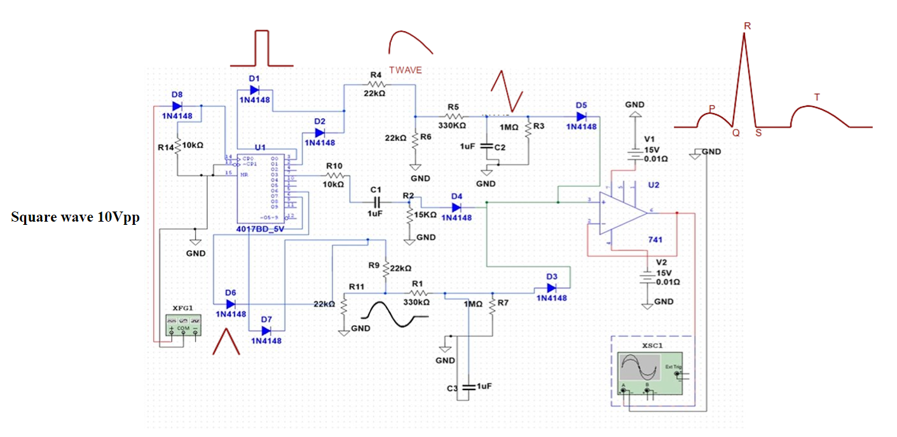
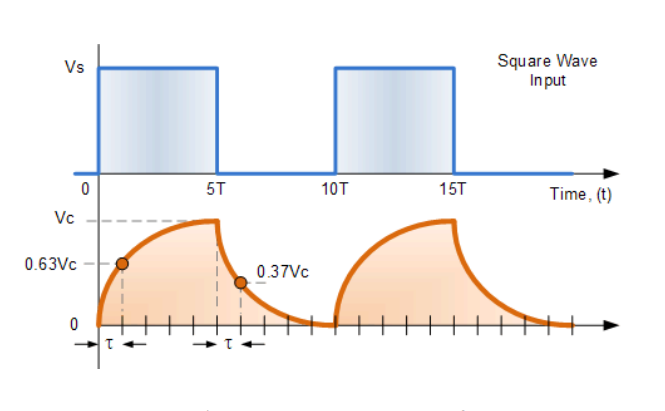
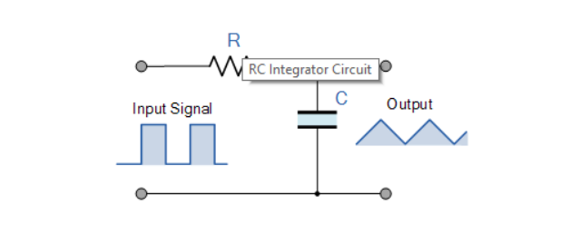
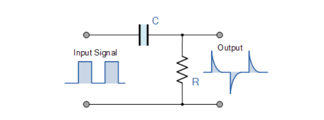
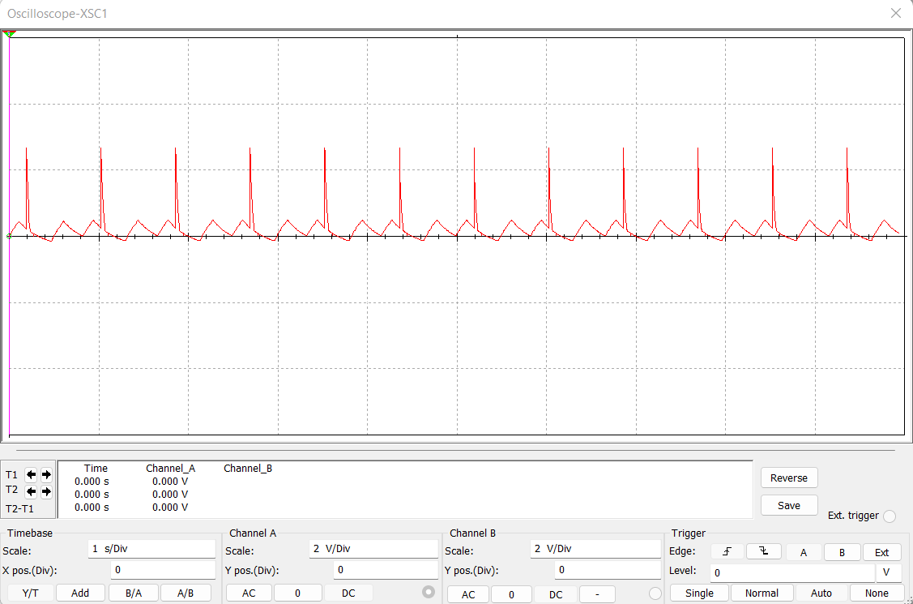
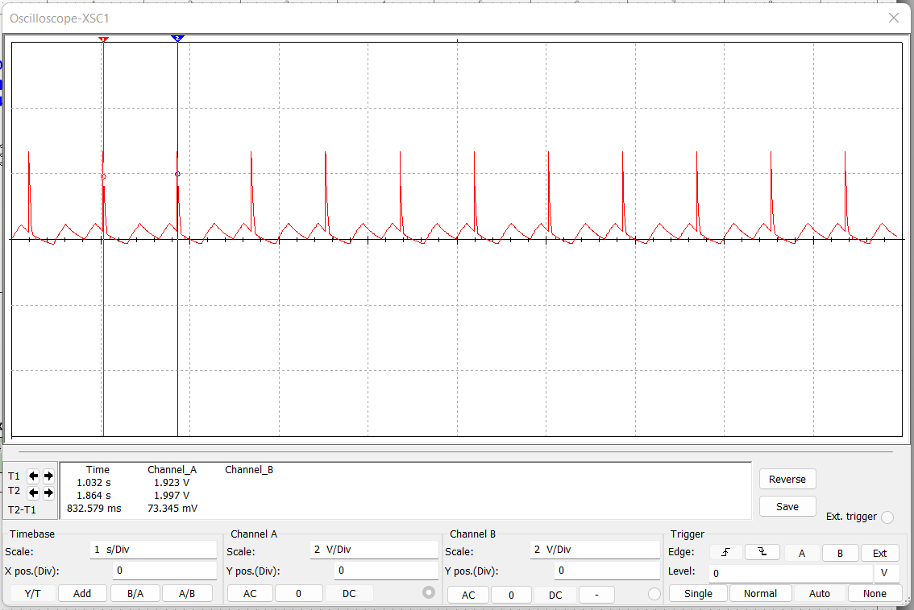
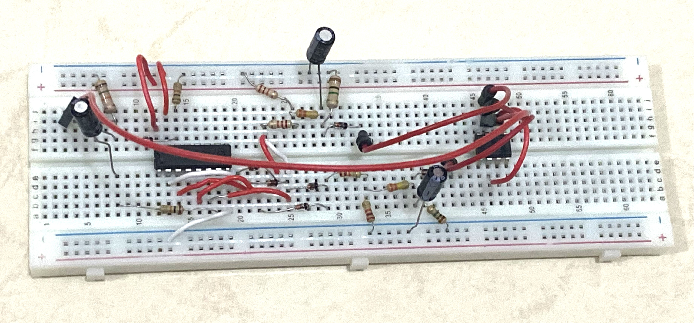

# ECG-Simulator-Device

## Overview

An **electrocardiogram (ECG)** is a graphical representation of the heart's bioelectrical activity during a cardiac cycle. It provides vital insights into a person’s health by displaying **P, Q, R, S, and T waves** in sinusoidal and periodic patterns. This project focuses on designing an ECG simulator that continuously generates typical **ECG waveforms**, eliminating the need for direct electrode-based readings. The simulator is implemented using an **instrumentation amplifier** and a **Johnson counter (IC 4017)** in **Multisim software**, ensuring accurate waveform generation. It serves as a reliable tool for testing ECG amplifiers, aiding in biomedical research and medical device development.

---

## Component Used

- **Power Supplies**: Fixed (+5V) & Dual (+/-15V)
- **Function Generator**
- **Digital Storage Oscilloscope (DSO)**
- **CD4017 IC** (Decade Counter)
- **IC 741C** (Operational Amplifier)
- **1N4148 Diodes** (8 units)
- **Capacitors**: 1µF (3 units)
- **Resistors**: 10kΩ, 15kΩ, 22kΩ, 330kΩ, 1MΩ (11 units)
- **Probes, Wires, and Breadboard**

---

## Design

### 1. Multisim Simulation

Before hardware construction, the ECG waveform was modeled in **Multisim**. The **CD4017 Johnson counter** was used to generate distinct waveform components:

- **P Wave** (First two clock cycles): Formed using an **integrator circuit**. The capacitor charges during Q0 and Q1, and discharges during Q2, shaping the waveform. Amplitude adjustments were made via a potentiometer.

- **QRS Complex** (Q3 output): Derived using a **differentiator circuit**, where subtraction of Q3 output helped in forming the sharp QRS peaks.

- **T Wave** (Q6 and Q7 outputs): Created using another **integrator circuit**, ensuring a gradual recovery phase.

These three waves were **combined using a summing amplifier** with unity gain to generate a complete ECG signal.

The complete **Multisim simulation** can be found in: `./ECG-Simulator.ms14`

#### Design Parameters

| ECG Component   | Amplitude | Time Constant (RC) | Selected Values (C, R) |
| --------------- | --------- | ------------------ | ---------------------- |
| **P Wave**      | 0.3V      | 0.33s              | 1µF, 330kΩ             |
| **QRS Complex** | 1.2V      | 0.015s             | 1µF, 15kΩ              |
| **T Wave**      | 0.4V      | 0.33s              | 1µF, 330kΩ             |

#### Signal Processing Stages

To generate a precise ECG waveform, the circuit utilized:

<table>
  <tr>
    <td><strong>1. Square Wave Input</strong>  A square waveform served as the base signal.</td>
    <td></td>
  </tr>
  <tr>
    <td><strong>2. RC Integrator (Low-Pass Filter)</strong>  Converted the square wave into a smoother triangular waveform.  </td>
    <td></td>
  </tr>
  <tr>
    <td><strong>3. RC Differentiator (High-Pass Filter)</strong>  Converted square waves into sharp spikes, forming the QRS complex.</td>
    <td></td>
  </tr>
</table>

Therefore, the **simulated ECG output**:  

The **measured ECG signal time period**:  

---

### 2. Hardware Implementation

The simulated circuit was then built and tested in a real-world environment using the same components. The **circuit was assembled on a breadboard**:

1. **4017 IC Setup**:

   - The **4017 decade counter** was placed on the breadboard, with **VCC connected to +12V**.
   - **Grounded Reset (pin 13) and Inhibit (pin 15)** ensured stable operation.
   - A **10V, 12Hz square wave** from the **function generator** served as the clock pulse.
   - The counter output was tested to confirm that each pulse activated the expected pin sequentially.

2. **Waveform Generation**:

   - **P Wave Circuit**: Connected and adjusted for **1V amplitude**.
   - **QRS Complex Circuit**: Connected with a **1.9V amplitude differentiator**.
   - **T Wave Circuit**: Integrated and set to **1.1V amplitude**.

3. **Summing Amplifier Integration**:

   - The **P, QRS, and T wave outputs** were combined via a **summing amplifier (IC 741)**.
   - **Diodes** ensured proper signal combination.
   - The output was passed through a **capacitor** to stabilize the waveform.

4. **Final Analysis Using an Oscilloscope**:
   - The **ECG signal** was observed on a **digital storage oscilloscope (DSO)**.
   - **Time/div** scale: **0.5s** | **Volts/div** scale: **0.5V**.

The **fully connected hardware circuit**:  

---

## License & Copyright

This project is licensed under the **MIT License**.

You are free to use, modify, and distribute this project for **educational and research purposes**, but proper credit must be given to the original author **(Noora-Alhajeri)**.

### **Copyright Notice**

© 2025 **Noora-Alhajeri**. All rights reserved.

Originally Developed: **June 10, 2022**  
Uploaded to GitHub: **2025**

---

## Contact

For questions or collaboration, feel free to reach out:

📧 **Email:** [n.s3eedalhajeri@gmail.com](mailto:n.s3eedalhajeri@gmail.com)  
🌐 **LinkedIn:** [Noora-Alhajeri](https://www.linkedin.com/in/nsh019)
